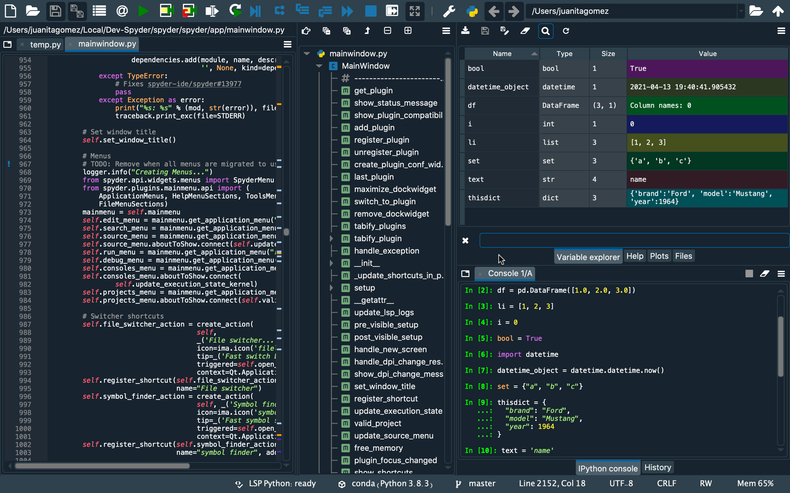

*Copyright © 2009–2018 Spyder Project Contributors*


[](./LICENSE)
[](https://pypi.python.org/pypi/spyder)
[](https://www.anaconda.com/download/)
[](https://www.anaconda.com/download/)
[](https://gitter.im/spyder-ide/public)
[](#backers)
[](#sponsors)

[](https://travis-ci.org/spyder-ide/spyder)
[](https://ci.appveyor.com/project/spyder-ide/spyder/branch/master)
[](https://circleci.com/gh/spyder-ide/spyder)
[](https://coveralls.io/github/spyder-ide/spyder?branch=master)
[](https://codecov.io/gh/spyder-ide/spyder)
[](https://github.com/spyder-ide/spyder)





## Overview

Spyder is a Python development environment with many features for research,
data analysis, and scientific package creation:

* **Editor**

    Work efficiently in a multi-language editor with a function/class browser,
    real-time code analysis tools (`pyflakes`, `pylint`, and `pycodestyle`),
    automatic code completion (`jedi` and `rope`),
    horizontal/vertical splitting, and go-to-definition.

* **Interactive console**

    Multiple IPython consoles with workspace and debugging support to
    instantly evaluate the code written in the Editor.
    Spyder consoles also come with full Matplotlib integration.

* **Documentation viewer**

    Render documentation in real-time with Sphinx for any class or function,
    whether external or user-created from either the Editor or a Console.

* **Variable explorer**

    Inspect any variables, functions or objects created during your session.
    Editing and interaction is supported with many common types, including
    numeric/strings/bools, Python lists/tuples/dictionaries, dates/timedeltas,
    Numpy arrays, Pandas index/series/dataframes, PIL/Pillow images, and more.

* **Development tools**

    Examine your code with the static analyzer, trace its execution with the
    interactive debugger, measure its performance with the profiler,
    and keep things organized with project support and a builtin file explorer.

* **Find in files**

    Search for queries across multiple files in your project,
    with full support for regular expressions.

* **History log**

    Browse an automatically de-duplicated listing of every command you run
    on any Spyder console.

Spyder may also be used as a PyQt5 extension library (module `spyder`).
For example, the Python interactive shell widget used in
Spyder may be embedded in your own PyQt5 application.


## Documentation

You can read the Spyder documentation online at [PythonHosted](
http://pythonhosted.org/spyder/).


## Installation

For a detailed guide to installing Spyder, please refer to our
[installation instructions](http://pythonhosted.org/spyder/installation.html).

The easiest way to install Spyder on any of our supported platforms
is to download it as part of the [Anaconda](https://www.anaconda.com/download/)
distribution, and use the `conda` package and environment manager to keep it
and your other packages installed and up to date.

If in doubt, you should always install Spyder via this method to avoid
unexpected issues we are unable to help you with; it generally has the
least likelihood of potential pitfalls for non-experts, and we may be
able to provide limited assistance if you do run into trouble.

Other install options exist, including:

* The [WinPython](https://winpython.github.io/) distribution for Windows
* The [MacPorts](http://www.macports.org/) project for macOS
* Your distribution's package manager (i.e. `apt-get`, `yum`, etc) on Linux
* The `pip` package manager, included with most Python installations

**However**, we lack the resources to provide individual support for users who
install via these methods, and they may be out of date or contain bugs outside
our control, so we recommend the Anaconda version instead if you run into issues.


## Troubleshooting

Before posting a report, *please* carefully read our **[Troubleshooting Guide](
https://github.com/spyder-ide/spyder/wiki/Troubleshooting-Guide-and-FAQ)**
and search the [issue tracker](https://github.com/spyder-ide/spyder/issues)
for your error message and problem description, as the great majority of bugs
are either duplicates, or can be fixed on the user side with a few easy steps.
Thanks!


## Contributing

Everyone is welcome to help with Spyder. Please read our
[contributing instructions](
https://github.com/spyder-ide/spyder/blob/master/CONTRIBUTING.md)
to get started!


## Running from a Github clone

Spyder can be run directly from the source code, hosted on the
[Spyder github repo](https://github.com/spyder-ide/spyder).
You may want to do this for fixing bugs in Spyder, adding new
features, learning how Spyder works or to try out development versions before
they are officially released.

If using `conda` (strongly recommended), this can be done by running the
following from the command line (the Anaconda Prompt, if on Windows):

```
conda install spyder
conda remove spyder
git clone https://github.com/spyder-ide/spyder.git
cd spyder
python bootstrap.py
```

Alternatively, you can use `pip` to install PyQt5 separately and
the other *runtime dependencies* listed below. However, beware:
this method is recommended for experts only, and you'll need to solve any
problems on your own. See the
[installation instructions](http://pythonhosted.org/spyder/installation.html)
for more details.


## Dependencies

**Important Note**: Most or all of the dependencies listed below come
with *Anaconda* and other scientific Python distributions, so you don't need
to install them seperatly in those cases.

### Build dependencies

When installing Spyder from its source package, the only requirement is to have
a Python version greater than 2.7 or 3.4 (Python <=3.3 is no longer supported).

### Runtime dependencies

* **Python** 2.7 or 3.4+: The core language Spyder is written in and for.
* **PyQt5** 5.2+: Python bindings for Qt, used for Spyder's GUI.
* **qtconsole** 4.2.0+: Enhanced Python interpreter.
* **Rope** 0.9.4+ and **Jedi** 0.9.0+: Editor code completion, calltips
  and go-to-definition.
* **Pyflakes**: Real-time code analysis.
* **Sphinx**: Rich text mode for the Help pane.
* **Pygments** 2.0+: Syntax highlighting for all file types it supports.
* **Pylint**: Static code analysis.
* **Pycodestyle**: Real-time code style analysis.
* **Psutil**: CPU and memory usage on the status bar.
* **Nbconvert**: Manipulation of notebooks in the Editor.
* **Qtawesome** 0.4.1+: To have an icon theme based on FontAwesome.
* **Pickleshare**: Show import completions on the Python consoles.
* **PyZMQ**: Run introspection services asynchronously.
* **QtPy** 1.2.0+: Abstraction layer for Python Qt bindings so that Spyder
  can run on multiple Qt bindings and versions.
* **Chardet**: Character encoding auto-detection in Python.
* **Numpydoc**: Used by Jedi to get function return types from Numpydocstrings.
* **Cloudpickle**: Serialize variables in the IPython kernel to send to Spyder.

### Optional dependencies

* **Matplotlib**: 2D/3D plotting in the Python and IPython consoles.
* **Pandas**: View and edit DataFrames and Series in the Variable Explorer.
* **Numpy**: View and edit 2- or 3-dimensional arrays in the Variable Explorer.
* **SymPy**: Symbolic mathematics in the IPython console.
* **SciPy**: Import Matlab workspace files in the Variable Explorer.
* **Cython**: Run Cython files in the IPython console.


## More information

[Download Spyder (with Anaconda)](https://www.anaconda.com/download/)

[Spyder Github](https://github.com/spyder-ide/spyder)

[Troubleshooting Guide and FAQ](
https://github.com/spyder-ide/spyder/wiki/Troubleshooting-Guide-and-FAQ)

[Development Wiki](https://github.com/spyder-ide/spyder/wiki/Dev:-Index)

[Gitter Chatroom](https://gitter.im/spyder-ide/public)

[Google Group](http://groups.google.com/group/spyderlib)

[Support Spyder on OpenCollective](https://opencollective.com/spyder/)
