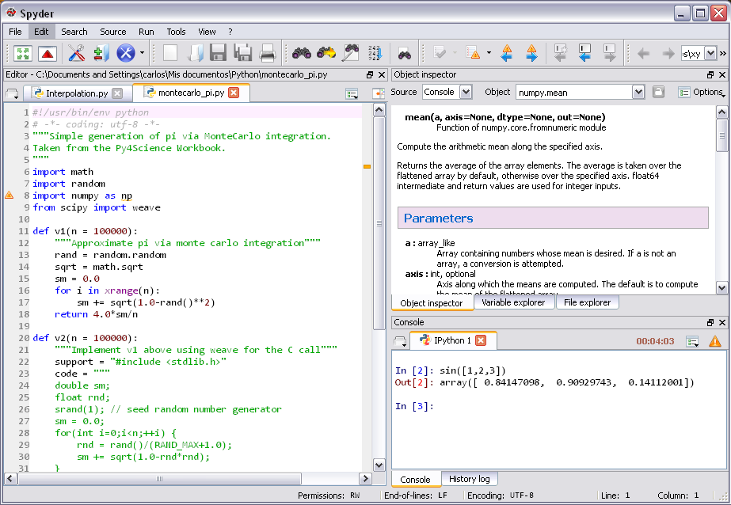

# Spyder - The Scientific PYthon Development EnviRonment

Copyright © 2009-2013 Pierre Raybaut.

Copyright © 2013-2015 The Spyder Development Team.

Licensed under the terms of the MIT License (see `LICENSE` for details)

## Overview

Spyder is a Python development environment with a lot of features:

* **Editor**

    Multi-language editor with function/class browser, code analysis
    features (pyflakes and pylint are currently supported), code
    completion, horizontal and vertical splitting, and goto definition.

* **Interactive console**

    Python or IPython consoles with workspace and debugging support to
    instantly evaluate the code written in the Editor. It also comes
    with Matplotlib figures integration. 

* **Documentation viewer**

    Show documentation for any class or function call made either in the
    Editor or a Console.

* **Variable explorer**

    Explore variables created during the execution of a file. Editing
    them is also possible with several GUI based editors, like a
    dictionary and Numpy array ones.

* **Find in files**

    Supporting regular expressions and mercurial repositories

* **File explorer**

* **History log**

Spyder may also be used as a PyQt4/PySide extension library (module 
`spyderlib`). For example, the Python interactive shell widget used in
Spyder may be embedded in your own PyQt4/PySide application.

## Documentation

You can read the Spyder documentation at:

http://pythonhosted.org/spyder/

## Running from source

The fastest way to run Spyder is to get the source code, install PyQt
or PySide, and run:

    python bootstrap.py
    
You may want to do this for fixing bugs in Spyder, adding new
features, learning how Spyder works or just getting a taste of it.

## Installation

This section explains how to install the latest stable release of
Spyder. If you prefer testing the development version, please use
the `bootstrap` script (see next section).

The easiest way to install Spyder is:

### On Windows:

- Using one of our executable installers, which can be found
  [here](https://github.com/spyder-ide/spyder/releases).
- Or using one of these scientific Python distributions:
  1. [Anaconda](http://continuum.io/downloads)
  2. [Python(x,y)](http://pythonxy.googlecode.com)
  3. [WinPython](https://winpython.github.io/)

### On Mac OSX:

- Using our DMG installer, which can be found
  [here](https://github.com/spyder-ide/spyder/releases).
- Using the [Anaconda Distribution](http://continuum.io/downloads).
- Through [MacPorts](http://www.macports.org/).

### On GNU/Linux

- Through your distribution package manager (i.e. `apt-get`, `yum`,
  etc).
- Using the [Anaconda Distribution](http://continuum.io/downloads).
- Installing from source (see below).

### Cross-platform way from source

You can install Spyder from its zip source package named `spyder-x.y.z.zip`,
found [here](https://github.com/spyder-ide/spyder/releases). Then you need to
use the standard Python `setup.py` script:

    python setup.py install

Note that `setup.py` is not able to uninstall previous versions of Python
packages: it simply copies files on top of an existing installation. So the
best way to install from source is to use the `pip` package manager:

    pip install .

Note the dot (`.`) at the end of this command. `pip` can also install Spyder
from the [Python package index](http://pypi.python.org/pypi) *and* upgrade an
existing installation

    pip install --upgrade spyder

For more details on supported platforms, please refer to our
[installation instructions](http://pythonhosted.org/spyder/installation.html).

## Dependencies

**Important note**: Most if not all the dependencies listed below come
with *Python(x,y)*, *WinPython* and *Anaconda*, so you don't need to install
them separately when installing one of these Scientific Python
distributions.

### Build dependencies

When installing Spyder from its source package, the only requirement is to have
a Python version greater than 2.6 (Python 3.2 is not supported anymore).

### Runtime dependencies

* **Python** 2.6, 2.7, 3.3 or 3.4
* **PyQt4** 4.6+, **PySide** 1.2.0+ or **PyQt5** 5.2+ (PyQt4 is recommended)

### Recommended modules

* **IPython** 3.0- or **qtconsole** 4.0+ (enhanced Python interpreter)
* **Rope** v0.9.4+ and/or **Jedi** 0.8 + (editor code completion, calltips
  and go-to-definition)
* **Pyflakes** v0.5.0+ (real-time code analysis)
* **Sphinx** v0.6+ (object inspector's rich text mode)
* **Matplotlib** v1.0+ (2D/3D plotting)
* **Pandas** v0.13.1+ (DataFrame and Series support)
* **Numpy** (N-dimensional arrays)
* **Scipy** (signal/image processing)

**Note**: To get IPython in Ubuntu you need to install `ipython-qtconsole`,
on Fedora `ipython-gui` and on Gentoo `ipython` with the `qt4` USE flag.

### Optional modules

* **Pygments** v1.6+ (syntax highlighting for all file types it supports).
* **Pylint** v0.25+ (static code analysis).
* **Pep8** v0.6+ (style analysis).
* **Psutil** v0.3+ (CPU and memory usage on the status bar)

## More information

* For code development please go to:

    <https://github.com/spyder-ide/spyder>

* For bug reports and feature requests:

    <https://github.com/spyder-ide/spyder/issues>

* For discussions and troubleshooting:

    <http://groups.google.com/group/spyderlib>
