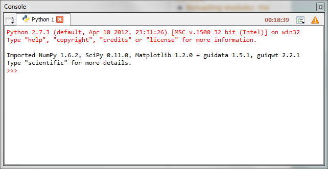

Console
=======

The **Console** is where you may enter, interact with and visualize data, 
inside a command interpreter. All the commands entered in the console are 
executed in a separate process, thus allowing the user to interrupt any 
process at any time.

Many command windows may be created in the **Console**:

* Python interpreter
* Running Python script
* System command window (this terminal emulation window has quite limited 
  features compared to a real terminal: it may be useful on Windows 
  platforms where the system terminal is not much more powerful - on the 
  contrary, on GNU/Linux, a real system terminal is opened, outside Spyder)

Python-based command windows support the following features:

* Code completion and calltips
* Variable explorer with GUI-based editors for arrays, lists, 
  dictionaries, strings, etc.
* Debugging with standard Python debugger (`pdb`): at each breakpoint 
  the corresponding script is opened in the :doc:`editor` at the breakpoint 
  line number
* User Module Deleter (see below)

Related plugins:

* :doc:`help`
* :doc:`historylog`
* :doc:`editor`
* :doc:`fileexplorer`
