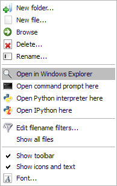

Explorer
========

The explorer plugin is a file/directory browser allowing the user to open files
with the internal editor or with the appropriate application (Windows only).

.. image:: images/explorer.png

Context menus may be used to run a script, open a terminal window or run a 
Windows explorer window (Windows only):

.. image:: images/explorer_menu1.png

Related plugins:

* :doc:`console`
* :doc:`editor`
