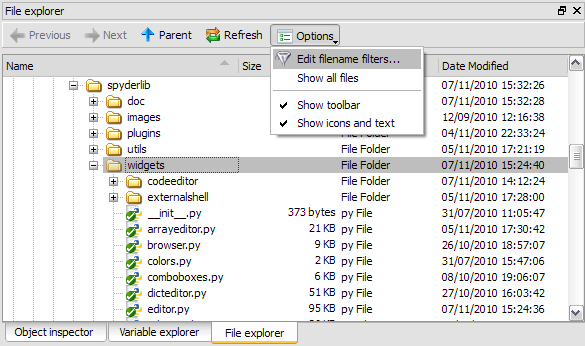
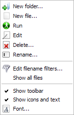
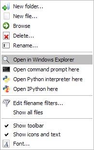

File Explorer
=============

The file explorer pane is a file/directory browser allowing the user to open
files with the internal editor or with the appropriate application (Windows
only).

|

|

Context menus may be used to run a script, open a terminal window or run a
Windows explorer window (Windows only):

|

|

|

Related plugins:

* :doc:`ipythonconsole`
* :doc:`editor`
