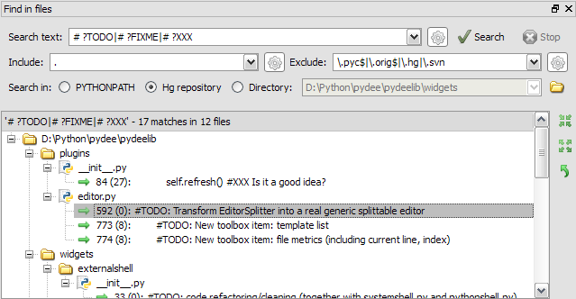

Find in files
=============

The *Find in Files* plugin provides text search in whole directories or 
`mercurial` repositories (or even in PYTHONPATH) with regular expression 
support for maximum search customization.

Related plugins:

* :doc:`editor`
