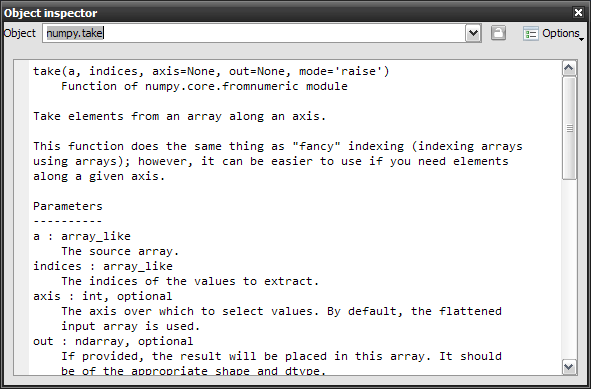
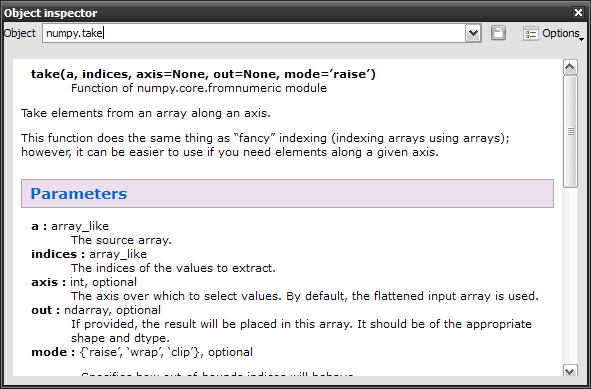
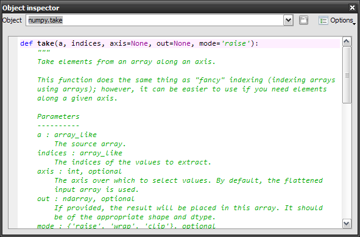

Help
====

The help plugin works together with the :doc:`console` and the 
:doc:`editor`: it shows automatically documentation available when the 
user is instantiating a class or calling a function (pressing the left 
parenthesis key after a valid function or class name triggers a call
in the help pane).

Note that this automatic link may be disabled by pressing the "Lock" button 
(at the top right corner of the window).

Of course, one can use the documentation viewer directly by entering an object 
name in the editable combo box field, or by selecting old documentation requests
in the combo box.

Plain text mode:

Rich text mode:

Sometimes, when docstrings are not available or not sufficient to document the 
object, the documentation viewer can show the source code (if available, i.e. 
if the object is pure Python):

Related plugins:

* :doc:`console`
* :doc:`editor`
