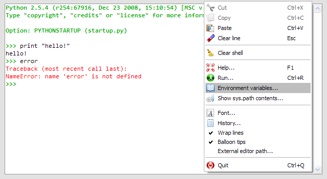

Internal Console
================

The **Internal Console** is dedicated to Spyder internal debugging or may be 
used as an embedded Python console in your own application.
All the commands entered in the internal console are executed in the same 
process as Spyder's, but the Internal Console may be executed in a separate 
thread (this is optional and for example this is not the case in Spyder itself).

|

|

The internal console support the following features:

* Code completion and calltips
