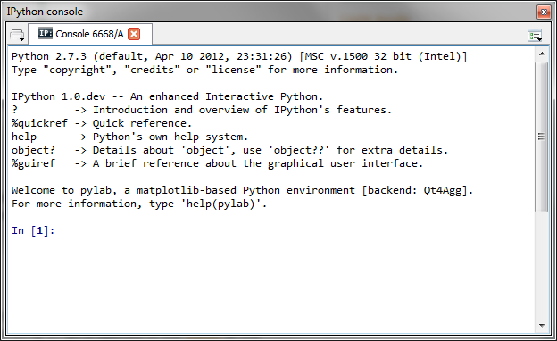
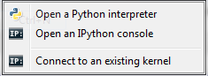
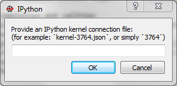

IPython Console
===============

Spyder's **IPython Console** implements a full two-process 
`IPython <http://ipython.org/>`_ session where
a lightweight front-end interface connects to a full IPython kernel on the
back end. Visit the IPython project website for full documentation of 
IPython's many features.

|

|

From the Consoles menu, Spyder can launch **IPython Console**
instances that attach to kernels that are managed
by Spyder itself or it can connect to external kernels that are managed
by IPython Qt Console sessions or the IPython Notebook.

|

|

When "Connect to an existing kernel" is selected, Spyder prompts for the 
kernel connection file details:

|

|

**IPython Consoles** that are attached to kernels that were created by
Spyder support the following features:

* Code completion
* Variable explorer with GUI-based editors for arrays, lists, 
  dictionaries, strings, etc.
* Debugging with standard Python debugger (`pdb`): at each breakpoint 
  the corresponding script is opened in the :doc:`editor` at the breakpoint 
  line number
* User Module Deleter (see :doc:`console` for more details)

**IPython Consoles** attached to external kernels support a smaller feature
set:

* Code completion
* Debugging toolbar integration for launching the debugger and sending
  debugging step commands to the kernel. Breakpoints must be set manually
  from the console command line.

Reloading modules: the User Module Reloader (UMR)
-------------------------------------------------

When working with Python scripts interactively, one must keep in mind that
Python import a module from its source code (on disk) only when parsing the
first corresponding import statement. During this first import, the byte code
is generated (.pyc file) if necessary and the imported module code object is
cached in `sys.modules`. Then, when re-importing the same module, this cached
code object will be directly used even if the source code file (.py[w] file)
has changed meanwhile.

This behavior is sometimes unexpected when working with the Python interpreter
in interactive mode, because one must either always restart the interpreter
or remove manually the .pyc files to be sure that changes made in imported
modules were taken into account.

The User Module Reloader (UMR) is a Spyder console's exclusive feature that
forces the Python interpreter to reload modules completely when executing
a Python script.

For example, when UMR is turned on, one may test complex applications
within the same Python interpreter without having to restart it every time
(restart time may be relatively long when testing GUI-based applications).

Related plugins:

* :doc:`help`
* :doc:`editor`
* :doc:`fileexplorer`
