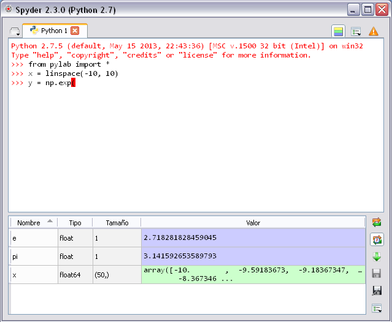

Light mode
==========

Spyder may be started in *light mode* with the following command:

    ``python spyder.py --light``

or

    ``python spyder.py -l``

The light mode is a very simple and light environment with the :doc:`console` 
and the :doc:`variableexplorer`.

Related plugins:

* :doc:`console`
* :doc:`variableexplorer`

