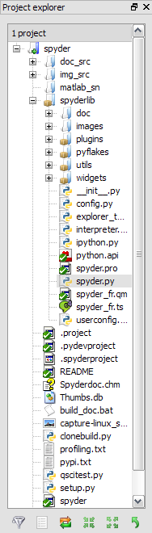
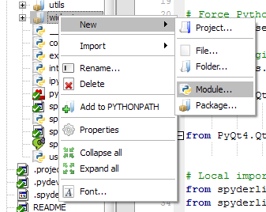
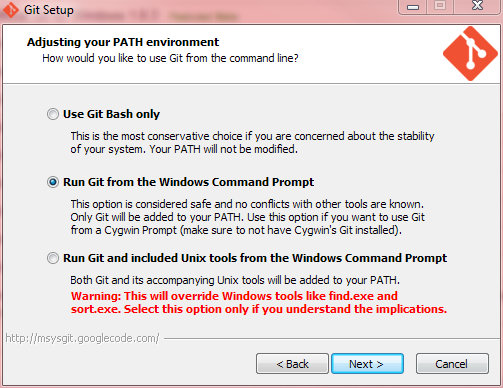

Projects
========

Spyder allows users to associate a given directory with a project. This has two
main advantages:

1. Projects remember the list of open files in Editor. This permits to easily
   work on several coding efforts at the same time.
2. The project's path is added to the list of paths Python looks modules for, so
   that modules developed as part of a project can be easily imported in any
   console.

To create a project, it is necessary to select the *New Project* entry from the
*Projects* menu:

|

.. image:: images/new_project.png
   :align: center

|

When a project is activated, the *Project explorer* pane is shown, which
presents a tree view structure of the current project

|

|

Through this pane it is possible to make several operations on the files that
belong to project

|

|

.. note:: Projects are completely optional and not imposed on users, i.e. users
   can work without creating any project.

Version Control Integration
---------------------------

Spyder has limited integration with Git_ and Mercurial_. Commit and browse
commands are available by right-clicking on relevant files that reside within
an already initialized repository. This menu assume that certain commands are
available on the system path.

* For Mercurial repositories, TortoiseHG_ must be installed, and either ``thg``
  or ``hgtk`` must be on the system path.
* For git repositories, the commands ``git`` and ``gitk`` must be on the
  system path. For Windows systems, the `Git for Windows`_ package provides a
  convenient installer and the option to place common git commands on the
  system path without creating conflicts with Windows system tools.
  The second option in the dialog below is generally a safe approach.

.. _Git: http://git-scm.com/
.. _Mercurial: http://mercurial.selenic.com/
.. _TortoiseHg: http://tortoisehg.bitbucket.org/
.. _Git for Windows: https://git-for-windows.github.io/
