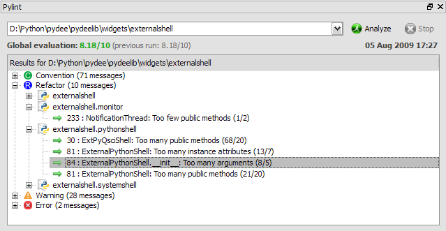

Pylint extension
================

Pylint extension may be used directly from the :doc:`editor`, or by entering 
manually the Python module or package path - i.e. it works either with `.py` 
(or `.pyw`) Python scripts or with whole Python packages (directories containing
an `__init__.py` script).

Related plugins:

* :doc:`editor`
