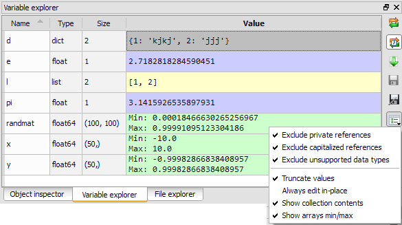

Variable Explorer
=================

The variable explorer shows the `globals()` namespace contents (i.e. all global 
object references) of the current console: it supports both the :doc:`console` 
(Python interpreter running in a remote process) 
and the :doc:`internalconsole`.

.. image:: images/variableexplorer1.png

The following screenshots show some interesting features such as editing 
lists, strings, dictionaries, NumPy arrays, or plotting/showing NumPy arrays
data.

.. image:: images/listeditor.png

.. image:: images/texteditor.png

.. image:: images/dicteditor.png

.. image:: images/arrayeditor.png

.. image:: images/variableexplorer-plot.png

.. image:: images/variableexplorer-imshow.png

The default variable explorer configuration allows to browse global variables 
without slowing the console even with very large NumPy arrays, lists or 
dictionaries. The trick is to truncate values, to hide collection contents 
(i.e. showing '<list @ address>' instead of list contents) and to *not* show 
mininum and maximum values for NumPy arrays (see context menu options on the 
screenshot at the top of this page).

However, most of the time, choosing the opposite options won't have too much 
effect on console's performance:

Supported types
---------------

The variable explorer can't show all types of objects. The ones currently
supported are:

#. `Pandas` DataFrames and TimeSeries
#. `NumPy` arrays and matrices
#. `PIL/Pillow` images
#. `datetime` dates
#. Integers
#. Floats
#. Complex numbers
#. Lists
#. Dictionaries
#. Tuples
#. Strings

Related plugins:

* :doc:`console`
* :doc:`internalconsole`
