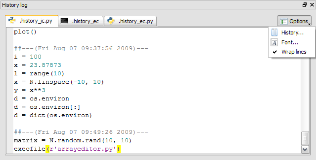

History log
===========

The history log plugin collects command histories of:
    * the :doc:`console`
    * the :doc:`extconsole` Python shells
    * the :doc:`extconsole` terminal windows

Related plugins:
    * :doc:`console`
    * :doc:`extconsole`
