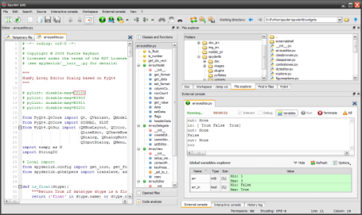

Welcome to Spyder's documentation!
==================================

Spyder is a Python development environment with advanced editing, interactive 
testing, debugging and introspection features. It is especially recommended for 
scientific computing thanks to `NumPy` (linear algebra), `SciPy` (signal and 
image processing), `matplotlib` (interactive 2D/3D plotting) and MayaVi's 
`mlab` (interactive 3D visualization) support.

Spyder may also be used as an extension library providing powerful 
console-related PyQt4 widgets.

Spyder websites:
    * Downloads, bug reports and feature requests: http://spyderlib.googlecode.com
    * Discussions: http://groups.google.com/group/spyderlib
            

Contents:

.. toctree::
    :maxdepth: 2
    :glob:
    
    overview
    installation
    shortcuts
    options
    console
    inspector
    onlinehelp
    historylog
    extconsole
    explorer
    projectexplorer
    editor
    findinfiles
    pylint
    

Indices and tables:

* :ref:`genindex`
* :ref:`search`

