Screenshots
===========

Screenshots
-----------

Here are a few snapshots comparing the use of QDarkStyle and the
default style. Click in the image to zoom.

Containers (no tabs) and Buttons
--------------------------------

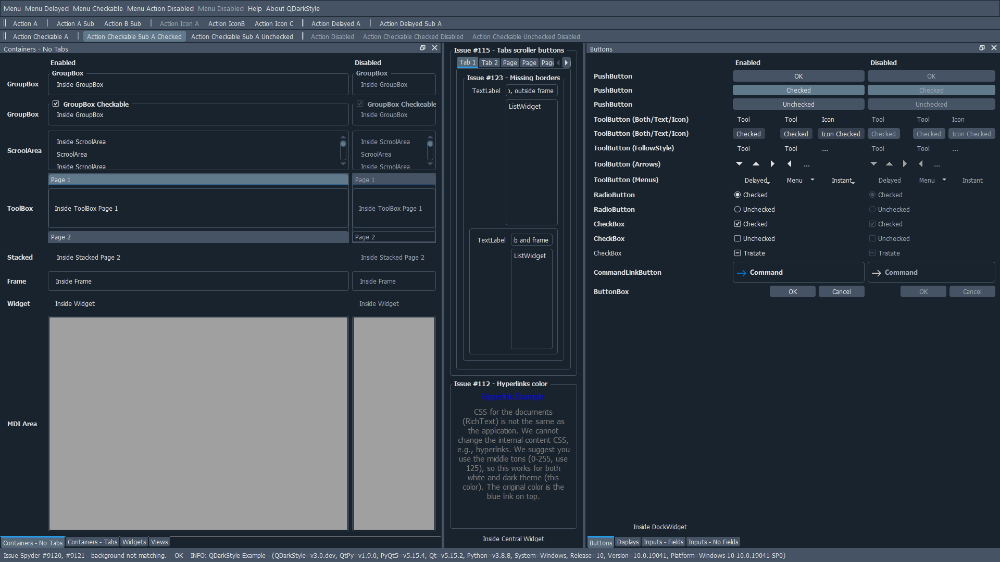

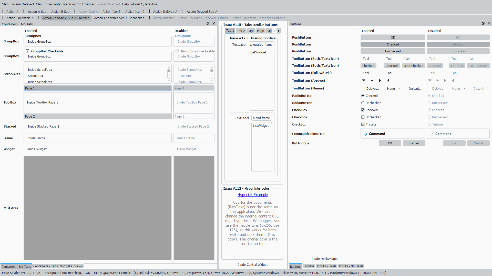

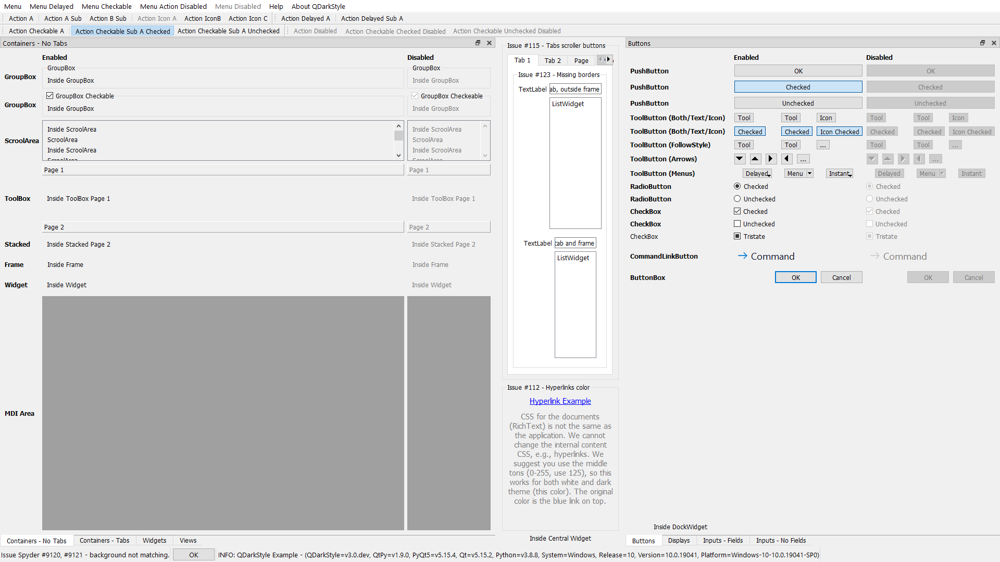

Containers (tabs) and Displays
------------------------------

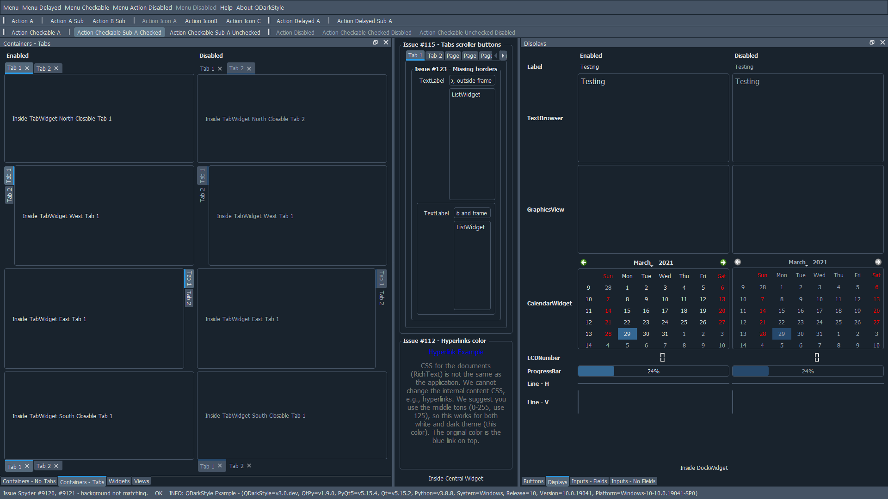

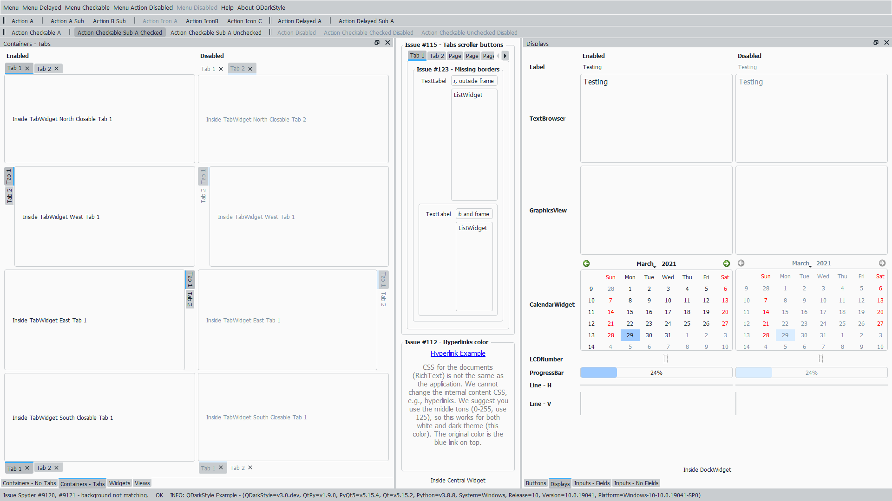

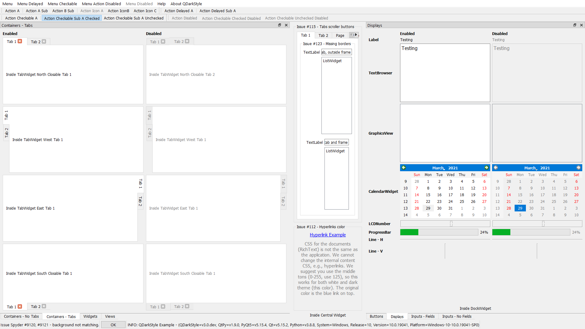

Widgets and Inputs (fields)
---------------------------

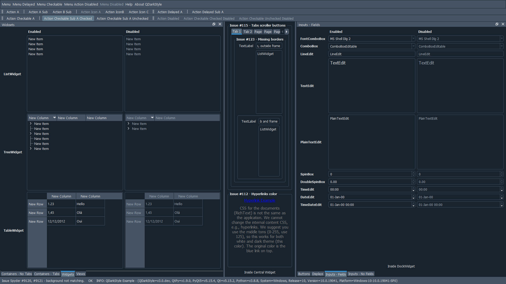

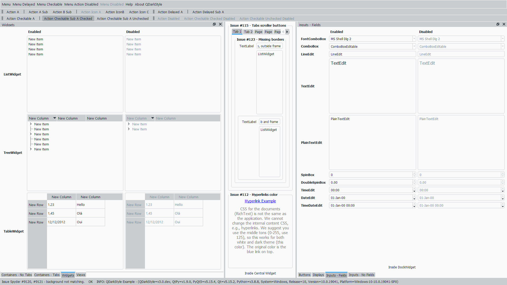

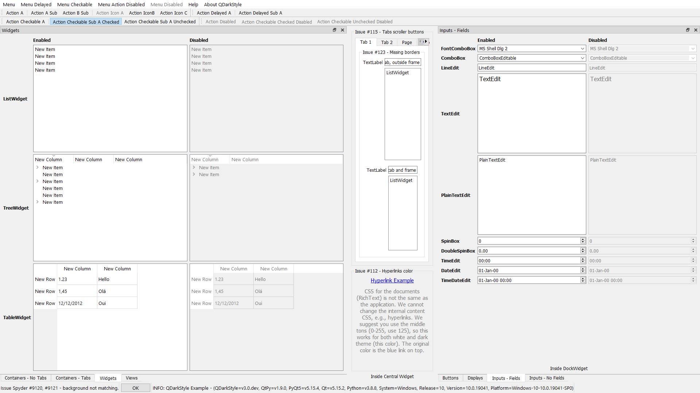

Views and Inputs (no fields)
----------------------------

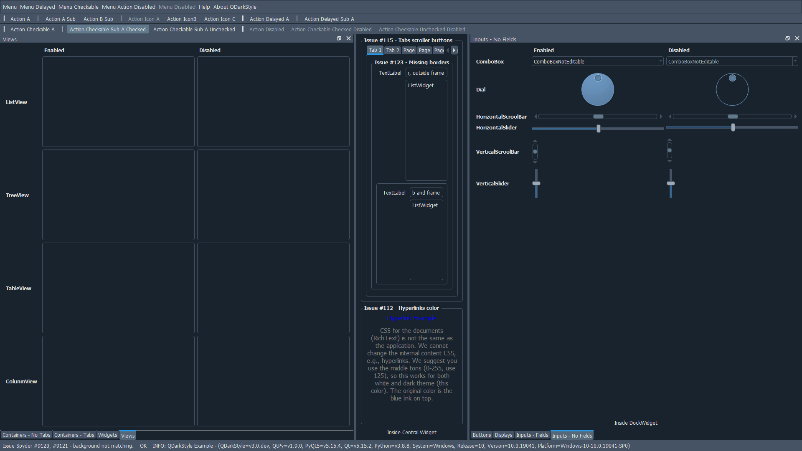

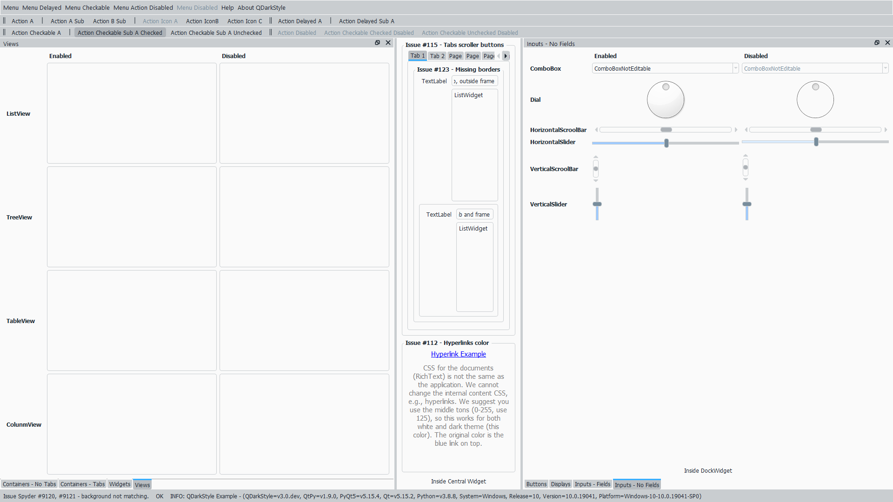

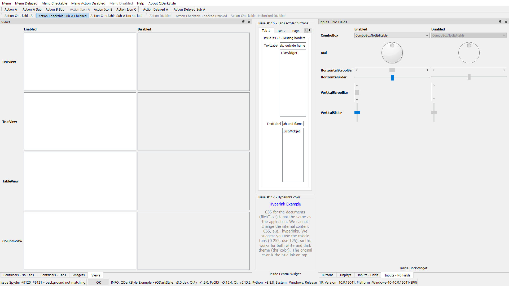
