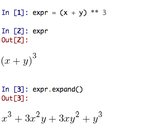
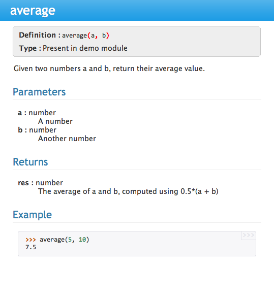

=======================
Spyder - the Python IDE
=======================

Spyder is an Integrated Development Environment (IDE) for scientific
computing using the Python programming language. It comes with an
Editor to write code, a Console to evaluate it and see its results at
any time, a Variable Explorer to see what variables have been defined
during evaluation, and several other facilities to help you to
effectively develop the programs you need as a scientist.

In recent years, Spyder has developed into a fairly mature and very
productive tool. This documentation, authored by 
`Hans Fangohr <http://www.southampton.ac.uk/~fangohr>`__ 
from the University of
Southampton (UK) originated from training courses in Python and
Computational Modelling for students at the University of Southampton
(see `historical note`_ for more detail).

.. contents:: Outline

.. sectnum::

----------

First steps with Spyder
#######################

Execute a given program
-----------------------

We use this program as an example:

.. include:: static/code/python/spyder/hello.py
   :literal:

* Get the hello world file into the Spyder editor window by

  * clicking on `hello.py <static/code/python/spyder/hello.py>`__ to see the
    source code in the webbrowser, then copy the whole code, and

  * navigate to the editor window in spyder and paste the code. Then
    save the file as ``hello.py``.

* To execute the program, select ``Run > Run`` (or press F5), and
  confirm the ``Run settings`` if required.

  You should see output like::

    Hello World
    >>>

  or (the particular path will depend on where you have saved the
  file, but this is inserted by Spyder automatically)::

    >>> runfile('/Users/fangohr/Desktop/hello.py', wdir=r'/Users/fangohr/Desktop')
    Hello World
    >>>

  If so, then you have just run your first Python program - well done.

Start IPython
~~~~~~~~~~~~~

Before we proceed, please

* `Switch to an IPython console`_

  The IPython console can do a little more than the standard Python
  console, and we suggest to use it as the default console here.

  In the IPython interpreter session that we have just started, you can use
  ``Run>Run`` (as before) to execute ``hello.py`` and you should see::

    In [1]: runfile('/Users/fangohr/Desktop/hello.py', wdir='/Users/fangohr/Desktop')
    Hello World

Background information: What happens when you execute the program?
~~~~~~~~~~~~~~~~~~~~~~~~~~~~~~~~~~~~~~~~~~~~~~~~~~~~~~~~~~~~~~~~~~

* Python reads the file line by line, ignoring comments

* When it comes across the ``def`` keyword, it knows that a function
  is DEFined in this and the next (one or more) lines. In the
  ``hello.py`` file, Python thus creates a *function object* with name
  ``hello``. All *indented* lines following ``def hello():`` belong to
  the function body.

  Note that the function object is just created at this point in the
  file, but the function is not yet called (i.e. not executed).

* When Python comes across commands (other than ``def ...`` and a few
  other keywords) that are written in the left-most column, it will
  execute these immediately. In the ``hello.py`` file this is only the
  line reading ``hello()`` which will actually call (i.e. *execute*)
  the function with name ``hello``.

  If you remove the line ``hello()`` from the program and run the whole file
  again (by pressing F5, or selecting ``Run > Run``), nothing will be
  printed (because the function ``hello`` is defined, but not called,
  i.e. not executed).

Now you should know how to execute a Python program that you have in
the editor window in Spyder using the Python Console, and the more
sophisticated IPython Console.

If you are just starting to learn Python, this is probably a good
point to return to your text book / course and look at more basic
examples.

The next section gives more detailed information how you can execute
*parts* of the code in the editor in the Python console, and thus
update parts of your definitions in the editor. This is a more
advanced technique but can be very useful. (You may also be interested
in the option to execute chunks (so-called "cells") of code that are
seperated by delimiters -- see `Shortcuts for useful functions`_.)

Call existing function objects from the command line
----------------------------------------------------

Once you have executed the ``hello.py`` program, the function object ``hello``
is defined and known at the Python prompt. We can thus call the function from
the Python prompt:

* Call the ``hello()`` function from the Python prompt, i.e. type
  ``hello()`` in the Python Shell window (the Python prompt shows as
  ``>>>``, or as ``In [?]`` if we use the IPython session where the
  question mark can be any positive integer number.), and press the
  return key.

  You should find that the ``hello()`` function is executed again,
  i.e. ``Hello World`` is printed again. Your function call at the
  Python prompt together with the output should look like this::

    In [ ]: hello()
    Hello World

* Can you see how this differs from executing the whole program again?

  When we execute the whole program (by pressing F5), Python goes
  through the file, creates the ``hello`` function object (overriding
  the previous object), reaches the main program and calls the
  function.

  When we call ``hello()`` from the Python prompt, we only call the
  function objects ``hello`` that has been defined in the (I)Python
  console when we executed the whole ``hello.py`` file earlier (by
  pressing ``F5``).

  This will become clearer over time and also when we work with
  slightly larger examples. You may want to return to this tutorial at
  a slightly later stage.

Inspecting objects
------------------

* Python provides a function that displays all known objects (in the
  current name space). It is called ``dir()``: when you type ``dir()``
  at the prompt, you get a list of known objects. Ignore everything
  starting with an underscore for now. Can you see ``hello`` in the
  list?

  .. note::

    If you get a long list of defined objects, then Spyder may have
    done some convenience imports for you already. To address this you
    may want to:

    - `Reset the name space`_ (you may want to follow instructions
      at `No convenience imports in IPython Console`_ to change the
      default settings)

    - execute the file ``hello.py`` again by pressing F5

    Then run ``dir()`` as suggested above.

* Once an object is visible in the current name space (as is ``hello``
  in this example), we can use the ``help`` function as follows to
  learn about it: Type ``help(hello)`` at the Python prompt, you
  should see output like this::

    In [ ]: help(hello)
    Help on function hello in module __main__:

    hello()
        Print "Hello World" and return None

  Where does Python take the information from? Some of it (like the
  number of input arguments and names of those variables; here we have
  no input arguments) Python can find through inspecting its objects,
  additional information comes from the documentation string provided
  for the function object ``hello``. The documentation string is the
  first string immediately below the line ``def hello():``.

  This strings are special, and they are called *docstring* which is short for
  *documentation strings*. As they usually extend over multiple lines, there
  are enclosed by triple single quotes (``'''``) or triple double quotes
  (``"""``).

* The Spyder environment also provides the ``Object inspector`` which
  by default is located in the top right corner.

  While the cursor is on the name of an object,
  press ``CTRL+i`` (or ``CMD+i`` on Mac), and you should find that
  the same information as we obtained from ``help(hello)`` is provided
  automatically in the object inspector:

  .. image:: static/images/spyder-hello-docstring.png

  This works in the console and in the editor (as of `Spyder version`_ 2.3).

Updating objects
----------------

Simple strategy: re-execute whole program
~~~~~~~~~~~~~~~~~~~~~~~~~~~~~~~~~~~~~~~~~

* In the Editor window, change the function ``hello`` so
  that it prints ``Good Bye World`` rather than ``Hello World``.

* Press F5 (to execute the whole program) and check that the output of the
  program is now::

    Good Bye World

What has happened when you pressed F5 is this: Python has gone through
the ``hello.py`` file and created a new function object ``hello``
(overriding the function object ``hello`` we had defined before) and
then executed the function.

Looking at the details
~~~~~~~~~~~~~~~~~~~~~~

We need to start with a clearly defined state. To do this, please change the
function ``hello()`` back so that it prints ``Hello World`` (i.e. use the
original `hello.py <static/code/python/spyder/hello.py>`__ file), then press
F5 to run the whole program and check that it prints ``Hello World``.

* Call the function ``hello()`` from the command prompt (as described
  in `Call existing function objects from the command line`_). You
  should see ``Hello World`` printed.

* Now change the function definition so that it would print ``Laters
  World``, and save the file (but do NOT execute the program, i.e. do
  NOT press F5 yet).

* Call the function ``hello()`` from the command prompt again. You
  should find that the text printed reads ``Hello World``, like here
  ::

    In [ ]: hello()
    Hello World

  Why is this so? Because the ``hello`` function object in the Python
  *interpreter* is the old one which prints ``Hello World``. So far, we have
  changed the file ``hello.py`` (and replaced ``Hello World`` in there with
  ``Laters World``) in the editor but this has not affected the objects that
  have previously been created in the Python interpreter.

Here are two possibilities to use our modified version of the ``hello``
function:

* Option 1: execute the whole file ``hello.py`` again by pressing F5:
  this creates a new function object ``hello`` (and overrides the old
  one). You should find that if you press F5, and then call
  ``hello()`` at the prompt, the new text ``Laters World`` is printed.

* Option 2: select the region you have changed (in this case the whole
  function ``hello``, starting from the line ``def hello():`` down to
  ``return None``, and then select ``Run > Run selection``.

  This will update the ``hello`` object in the interpreter without
  having to execute the whole ``hello.py`` file::

     In [ ]: def hello():
        ...:     """Print "Hello World" and return None"""
        ...:     print("Laters world")
        ...:

  If we now type ``hello()``, we see the update response::

     In [ ]: hello()
     Laters world

The ability to execute *parts of the code* to update some objects in
the interpreter (in the example above, we updated the function object
``hello``), is of great use when developing and debugging more complex
codes, and when creating objects/data in the interpreter session take
time. For example, by modifying only the functions (or
classes/objects, etc) that we are actually developing or debugging, we
can keep re-using the data and other objects that are defined in the
interpreter session.

Recommended first steps for Python beginners
############################################

To teach and learn Python programming, we recommend
to (i) use IPython instead of the normal Python interpreter and (ii)
not use any convenience imports. This accepts IPython as the de-facto
standard and helps to better understand namespaces.

Spyder tries to help more advanced users by importing a number of modules into
the main name space. Type ``scientific`` in the command prompt to see the
details. This behaviour may change in future Spyder releases.

While these convenience imports are very useful for more experienced
programmers, they can be confusing (if not misleading) for beginners. We
thus recommend to ``undo`` these imports to fulfil our requirements
outline above and to (i) `switch to an IPython console`_, and (ii)
issue the ``%reset`` command to `reset the name space`_. Both steps are
explained in more detail in the next section.

Switch to an IPython console
----------------------------

In the console window (lower right corner by default), you see by
default a prompt with three greater than signs, i.e. ``>>>``. This
shows that we are using the ``console`` -- basically a normal Python
interpreter session (with some added functionality from Spyder).

Instead, we would like to use an *Interactive Python* shell, short *IPython*
from the `ipython project <http://www.ipython.org>`__. To do this, select
``Interpreters`` > ``Open an IPython Console``.

You should see in the consolse window a new shell appearing, and the
IPython prompt ``In [``\ **1**\ ``]:`` should be displayed.

See also: `Change Spyder settings to always start with an IPython shell`_

Reset the name space
--------------------

The `name space <http://bytebaker.com/2008/07/30/python-namespaces/>`__
can be cleared in IPython using the ``%reset``
command. Type ``%reset`` and press return, then confirm with ``y``::

  In [1]: %reset

  Once deleted, variables cannot be recovered. Proceed (y/[n])? y

  In [2]:

That's all.

We discuss this a little further, but you can skip the following if
you are not interested: After issuing the ``%reset`` command, we
should have only a few objects defined in the name space of that
session. We can list all of them using the ``dir()`` command::

  In [2]: dir()
  Out[2]:
  ['In',
   'Out',
   '__builtin__',
   '__builtins__',
   '__name__',
   '_dh',
   '_i',
   '_i2',
   '_ih',
   '_ii',
   '_iii',
   '_oh',
   '_sh',
   'exit',
   'get_ipython',
   'help',
   'quit']

Finally, if you like to skip the confirmation step of the ``reset``
command, use can use ``%reset -f`` instead of ``%reset``.

Strive for PEP8 Compliance
--------------------------

In addition to the Syntax that is enforced by Python, there are
additional conventions regarding the layout of source code, in
particular the `Style Guide for Python source code
<http://www.python.org/dev/peps/pep-0008/>`__ known as "PEP8". By
writing code in the same style, it becomes easier to read, and
thus easier to debug and re-use - both for the original author
and others.

You should change Spyders settings to
`Warn if PEP8 coding guidelines are violated`_.

Selected Preferences
####################

Where are the preferences?
--------------------------

A lot of Spyder's behaviour can be configured through it's
Preferences. Where this is located in the menu depends on your
operating system:

* On Windows and Linux, go to ``Tools > Preferences``

* On Mac OS, go to ``Python/Spyder > Preferences``

Change Spyder settings to always start with an IPython shell
------------------------------------------------------------

Go to ``Preferences > IPython console > Startup`` and
select the tickbox next to ``Open an IPython console at
startup``. Then click the ``OK`` button.

The next time Spyder starts, it will show the IPython console
automatically.

Warn if PEP8 coding guidelines are violated
-------------------------------------------

Go to ``Preferences > Editor > Code
Introspection/Analysis`` and
select the tickbox next to ``Style analysis (PEP8)``

No convenience imports in Python Console
----------------------------------------

To avoid any 'magic' when the console is started, go to

``Preferences > Console > Advanced Settings > PYTHONSTARTUP
replacement``
and select ``Default PYTHONSTARTUP script`` (and restart Spyder).

(This magic, amongst other things, runs the ``from __future__ import
division`` which provides `integer division as in Python 3
<https://mail.python.org/pipermail/tutor/2008-March/060886.html>`__)

The `default settings may change
<https://groups.google.com/forum/#!topic/spyderlib/yTm4j9madZM>`__ for this in
the next major release.

No convenience imports in IPython Console
-----------------------------------------

To avoid import of all objects from ``pylab`` and ``numpy`` into the
current name space in the IPython Console, go to
``Preferences > IPython console > Graphics`` and
deselect the tickbox next to ``Automatically load Pylab and NumPy
modules`` and also deselect ``Activate support``.

The `default settings may change
<https://groups.google.com/forum/#!topic/spyderlib/yTm4j9madZM>`__ for this in
the next major release.

Automatic Symbolic Python
-------------------------

Through ``Preferences > IPython console > Advanced Settings > Use
symbolic math`` we can activate IPython's SYMbolic PYthon (sympy) mode that is
provided by the `sympy <http://sympy.org>`__ module. This mode
in Spyder allows nicely rendered sympy output (latex style) and also imports
some sympy objects automatically when the IPython console starts, and
reports what it has done.

.. code-block:: python

    These commands were executed:
    >>> from __future__ import division
    >>> from sympy import *
    >>> x, y, z, t = symbols('x y z t')
    >>> k, m, n = symbols('k m n', integer=True)
    >>> f, g, h = symbols('f g h', cls=Function)

We can then use the variables ``x``, ``y``, for example like this:

Shortcuts for useful functions
##############################

- F5 executes the current file

- F9 executes the currently highlighted chunk of code: this is very   useful
  to update definitions of functions (say) in the interpreter session without
  having to run the whole file again

- ``CTRL + <RETURN>`` executes the current cell (menu enty ``Run > Run
  cell``). A cell is defined as the   code between two lines which start with
  the agreed tag ``#%%``.

- ``SHIFT + <RETURN>`` executes the current cell and advances the
  cursor to the next cell (menu entry ``Run > Run cell and
  advance``).

  Cells are useful to execute a large file/code segment in smaller
  units. (It is a little bit like a cell in an IPython notebook, in
  that chunks of code can be run independently.)

- ``ALT + <CURSOR UP>`` moves the current line up. If multiple lines are
  highlighted, they are moved up together. ``ALT+<CURSOR DOWN>``
  works correspondingly moving line(s) down.

- ``CTRL+Left Click`` on a function/method in the source, opens a new
  editor windows showing the definition of that function.

- ``SHIFT+CTRL+ALT+M`` maximises the current window (or changes the
  size back to normal if pressed in a maximised window)

- ``SHIFT+CTRL+F`` activates the search across all files.

- On Mac OS X: ``CMD`` + ``+`` will increase the font size in the editor,
  ``CMD`` + ``-`` decrease. Also works in the IPython Console.

  The font size for the object explorer, the Python console etc can be set
  individually via ``Preferences > Object inspector`` etc.

  I couldn't find a way of changing the font size in the variable explorer.

- ``TAB`` autocompletes commands, function names, variable
  names, methods in the console (both Python and IPython) and in the
  Editor. This feature is very useful, and should be used
  routinely. Do try it now if autocompletion is new to you. 
  Assume you have defined a variable::

    mylongvariablename = 42

  Suppose we need to write code that computes ``mylongvariablename +
  100``, we can simply type ``my`` and then press the TAB key. The
  full variable name will be completed and inserted at the cursor
  position if the name is unique, and then we can carry on and type
  ``+ 100``. If the name is not uniquely identifiable given the
  letters ``my``, a list field will be displayed from which the right
  variable can be chosen. Choosing from the list can be done with the
  ``<CURSOR UP>`` key and ``<CURSOR DOWN>`` key and the ``<RETURN>``
  key to select, or by typing more letters of the name in question
  (the selection will update automatically) and confirming by pressing
  ``<RETURN>`` when the right name is identified.

- ``CMD+s`` (on Mac OS X) and ``CTRL+s`` (otherwise) *in the editor*
  window saves the file
  currently being edited. This also forces various warning triangles
  in the left column of the editor to be updated (otherwise they
  update every 2 to 3 seconds by default).

- ``CMD+s`` (on Mac OS X) and ``CTRL+s`` (otherwise) *in the IPython console*
  window saves the current IPython session as an HTML file, including
  any figures that may be displayed inline. This is useful as a quick
  way of recording what has been done in a session.

  (It is not
  possible to load this saved record back into the session - if you
  need functionality like this, look for the IPython Notebook.)

- ``CMD+i`` (on Mac OS X) and ``CTRL+i`` (otherwise) when pressed
  while the cursor is on an object, opens documentation for that
  object in the object inspector.

Run Settings
############

These are the settings that define how the code in the editor is
executed if we select ``Run > Run`` or press F5.

By default, the settings box will appear the first time we try to execute a
file. If we want to change the settings at any other time, they can be
found under ``Run > Configure`` or by pressing F6.

There are three choices for the interpreter to use, of which I'll discuss the
first two. Let's assume we have a program ``hello.py`` in the editor which
reads

.. code-block:: python

   def hello(name):
       """Given an object 'name', print 'Hello ' and the object."""
       print("Hello {}".format(name))

   i = 42
   if __name__ == "__main__":
       hello(i)

Execute in current Python or IPython interpreter
------------------------------------------------

This is the default suggestion, and also generally a good choice.

Persistence of objects I (after code execution)
~~~~~~~~~~~~~~~~~~~~~~~~~~~~~~~~~~~~~~~~~~~~~~~

Choosing ``Execute in current Python or IPython interpreter
setting`` under ``Run > Configure`` means that

1. When the execution of ``hello.py`` is completed, we can interact
   with the interpreter in which the program ran, and we can use the
   convenient IPython interpreter for this (rather than the default
   Python interpreter).

   In particular,

2. we can inspect and interact with objects that the execution of
   our program created, such as ``i`` and ``hello()``.

This is generally very useful for incremental coding, testing and
debugging: we can call ``hello()`` directly from the interpreter
prompt, and don't need to execute the whole ``hello.py`` for this
(although if we change the function ``hello()``, we need to execute
the file, or at least the function definition, to make the new
version of ``hello()`` visible at the interpreter; either by
executing the whole buffer or via ``Run > Run Selection``.)

Persistence of objects II (from before code execution)
~~~~~~~~~~~~~~~~~~~~~~~~~~~~~~~~~~~~~~~~~~~~~~~~~~~~~~

However, executing the code in the editor in the current interpreter
also means that

3. the code that executes can see other (global) objects that were
   defined in the interpreter session.

*This* persistence of objects is easily forgotten and usually not
required when working on small programs (although it can be of great
value occasionally). These objects could come from previous execution
of code, from interactive work in the interpreter, or from convenience
imports such as ``from pylab import *`` (Spyder may do some of those
convenience imports automatically).

This visibility of objects in the interpreter global name space to the
code we execute may also result in coding mistakes if the code
inadvertently relies on these objects.

Here is an example: imagine that

*   we run the code ``hello.py``. Subsequently, the variable ``i``
    is known in the interpreter as a global variable.

*   we edit the ``hello.py`` source and accidentally delete the line
    ``i = 42``

*   we execute the buffer containing ``hello.py`` again. At this
    point, the call of ``hello(i)`` will *not* fail because the
    interpreter has an object of name ``i`` defined, although this is
    not defined in the source of ``hello.py``.

At this point, we could save ``hello.py`` and (falsely) think it
would execute correctly. However, running it in a new Python
interpreter session (or via ``python hello.py`` in a terminal, say)
would result in an error, because ``i`` is not defined.

The problem arises because the code makes use of an object (here
``i``) without creating it. This also affects importing of modules: if
we had imported ``pylab`` at the IPython prompt, then our program will
see that when executed in this IPython interpreter session.

To learn how we can double check that our code does not depend on such
existing objects, see `How to double check your code executes correctly "on
its own"`_ .

Execute in new dedicated Python interpreter
-------------------------------------------

Choosing ``Execute in new dedicated Python interpreter`` under ``Run
> Configure`` will start *a new Python interpreter everytime* the
``hello.py`` program is executed. The major advantage of this mode
over `Execute in current Python or IPython interpreter`_ is that we
can be certain that there are no global objects defined in this
interpreter which originate from debugging and repeated execution of
our code: every time we run the code in the editor, the python
interpreter in which the code runs is restarted.

This is a safe option, but provides less flexibility and cannot use
the IPyton interpreter.

How to double check your code executes correctly "on its own"
-------------------------------------------------------------

Assuming you have chosen for your code to
`Execute in current Python or IPython interpreter`_,
then you have two options to check that your code does work on its own
(i.e. it does not depend on undefined variables, unimported modules
and commands etc.)

(i)  Switch from `Execute in current Python or IPython interpreter`_
     to `Execute in new dedicated Python interpreter`_,
     and execute the code in the editor in this dedicated Python interpreter.

     Alternatively, if you want to stay with the current IPython
     interpreter, you can

(ii) Use IPython's magic ``%reset`` command which will remove all
     objects (such as ``i`` in the example above) from the current name
     space, and then execute the code in the editor.

Recommendation
--------------

My recommendation for beginners would be to
`Execute in current Python or IPython interpreter`_, *and*
to choose the IPython interpreter for this (see also
`Change Spyder settings to always start with an IPython shell`_).

Once you have completed a piece of code, double check that it executes
independently using one of the options explained in
`How to double check your code executes correctly "on its own"`_\ .

Other observations
##################

Multiple files
--------------

When multiple files are opened in the editor, the
corresponding tabs at the top of the window area are arranged in
alphabetical order of the filename from left to right.

On the left of the tabs, there is as icon that shows ``Browse tabs``
if the mouse hovers over it. It is useful to jump to a particular
file directly, if many files are open.

Environment variables
---------------------

Environment variables can be displayed from the Console window (bottom right
window in default layout). Click on the ``Options`` icon (the tooltip is
``Options``), then select ``Environment variables``.

Reset all customisation
-----------------------

All customisation saved on disk can be reset by calling spyder from
the command line with the switch ``--reset``, i.e. a command like
``spyder --reset``.

Objects in the variable explorer
--------------------------------

Right-clicking on arrays in the variable explorer gives options to
plot and analyse these further.

Double clicking on a dictionary object opens a new window that
displays the dictionary nicely.

You can also show and edit the contents of numpy arrays, lists, numbers
and strings.

Documentation string formatting
###############################

There are some conventions assumed regarding documentation strings written in
special format called restructured text (`quick reference
<http://docutils.sourceforge.net/docs/user/rst/quickref.html>`__). If we
follow those guidelines, we can obtain beautifully formated documentation
strings in Spyder.

For example, to get our ``average()`` function look like this in the
Spyder Object inspector:

We need to format the documentation string as follows

.. code-block:: python

    def average(a, b):
        """
        Given two numbers a and b, return their average value.

        Parameters
        ----------
        a : number
          A number
        b : number
          Another number

        Returns
        -------
        res : number
          The average of a and b, computed using 0.5*(a + b)

        Example
        -------
        >>> average(5, 10)
        7.5

        """

        return (a + b) * 0.5

What matters here, is that the word ``Parameters`` is used, and
underlined. The line ``a : number`` shows us that the type of the
parameter ``a`` is ``number``. In the next line, which is indented, we
can write a more extended explanation what this variable represents,
what conditions the allowed types have to fulfill, etc.

The same for all Parameters, and also for the returned value.

Often it is a good idea to include an example as shown.

Debugging
#########

Line by line step execution of code
-----------------------------------

Activating the debug mode (``Debug > Debug``) starts the Python
debugger (Pdb) if the Python console is active, and starts the IPython
debugger (ipdb) if the IPython console is active. The debuggers are
operated as normal (a short introduction of key actions follows below),
but the editor display window in Spyder highlights the line that is about to be
executed, and the variable explorer displays variables in the current
context of the point of program execution. (It only displays
'numerical' variables, i.e. not function objects etc.)

The key commands within the debugger are individual keystrokes:

* ``s`` to Step into the current statement. If this is a function
  call, step into that function. 

* ``n`` move to the Next statement. If the current statement is a
  function, do not step into that function, but execute it completely
  before returning control to the interactive debugger prompt. This is
  the normal key to press to advance programme execution line by line.

* ``r`` complete all statements in the current function and Return
  from that function before returning control.

* ``p`` Print allows to display values of variables, for example
  ``p x`` will print the value of the variable ``x``.

Note that at the debugger prompt, you can also *change* values of variable. For
example, to modify a variable ``x`` at the IPython debugger prompt, you can say ``ipdb > x = 42``
and the debugger will carry on with ``x`` being bound to ``42``. You
can also call functions, and do many others things. Try this example::

   def demo(x):
       for i in range(5):
           print("i={}, x={}".format(i, x))
           x = x + 1
        
   demo(0)

If we execute this (``Run > Run``), we should fine the output::

	i=0, x=0
	i=1, x=1
	i=2, x=2
	i=3, x=3
	i=4, x=4
	
Now execute this using the debugger (``Debug > Debug``), press ``n``
until the highlighted line reaches the ``demo(0)`` function call, then
press ``s`` to Step into this function. Keep pressing ``n`` to execute
the next lines. Then, modify ``x`` by typing ``x=10`` in the debugger
prompt. You see x changing in the Variable explorer. You should also
see ``x`` changing when its value is printed as part of the ``demo()``
function. (The printed output appears between your debugger commands
and responses.)

This debugging ability to execute code line by line, to inspect variables as
they change, and to modify them manually is a powerful tool to
understand what a piece of code is doing (and to correct it if desired).

To leave the debugging mode, you can type ``exit`` or select from the
menu ``Debug > Debugging Control > Exit``

Debugging once an exception has occured with IPython
----------------------------------------------------

In the IPython console, we can call ``%debug``
straight after an exception has been raised: this will start the
IPython debug mode, and allows inspection of local variables at the
point where the exception occurred as described above. This is a lot
more efficient than adding ``print`` statements to the code an
running it again.

If you use this, you may also want to use the commands ``up``
(i.e. press ``u``) and ``down`` (i.e. press ``d``) which navigate the
inspection point up and down the stack. (Up the stack means to the
functions that have called the current function; down is the opposite
direction.)

Plotting
########

Matplotlib with IPython console
-------------------------------

Assuming we use an IPython console with version >= 1.0.0, we can
decide whether figures created with matplotlib/pylab will show

1. *inline*, i.e. inside the IPython console, or whether they should

2. appear inside a new window.

Option 1 is convenient to save a record of the interactive session
(section `Shortcuts for useful functions`_ lists a shortcut to save
the IPython console to an html file).

Option 2 allows to interactively zoom into the figure, manipulate it a little,
and save the figure to different file formats via the menu.

The command to get the figures to appear *inline* in the IPython
console is
``%matplotlib inline``.

The command to get figures appear in their own window (which
technically is a QT windown) is ``%matplotlib qt``.

The Spyder preferences can be used to customise the default behaviour
(in particular ``Preferences > IPython Console > Graphics >
Activate Support`` to switch into inline plotting).

Here are two lines you can use to quickly create a plot and test
this::

    import pylab
    pylab.plot(range(10), 'o'))

Matplotlib with Python
----------------------

If we use the Python console, we need to use matplotlib's or pylab's
``show()`` command to make a plot appear. It will appear in a new
window (there is no way of making it appear inline inside the Python
console - this only works for
`Matplotlib with IPython Console`_).

Here is a brief example that you can use to create and display a
plot::

    import pylab
    pylab.plot(range(10), 'o'))
    pylab.show()

Note that the ``show()`` command will bind the focus to new window
that has appeared, and that you will need to close that window before
Spyder can accept any further commands or respond to interaction. If
you cannot see the new window, check with your window manager whether
it may have appeared behind the spyder window, or be partly hidden, etc.

Historical note
###############

This tutorial is based on `notes
<http://www.southampton.ac.uk/~fangohr/blog/spyder-the-python-ide.html>`__
by `Hans Fangohr <http://www.southampton.ac.uk/~fangohr>`__, that are
used at the `University of Southampton <http://www.soton.ac.uk>`__ to
`teach Python for computational modelling
<http://www.southampton.ac.uk/~fangohr/teaching/python.html>`__ to
undegraduate engineers and postgraduate PhD students for the
`Next Generation Computational Modelling <http://ngcm.soton.ac.uk>`__
doctoral training centre.

Versions
########

Spyder version
--------------

The notes above have been created in September 2013 with Spyder 2.2.14
on Mac OS, installed via Anaconda.

Additions after 18 October 2013 tested with Spyder 2.2.4 and IPython 1.0.0.

Text has been reviewed by Carlos Cordoba for Spyder 2.3.

To find out what Spyder version you use, go to ``Python/Spyder > About`` (on
Mac OS X).

Changes
-------

22 September 2013: Update location of preferences, add notes on debugger and
variable explorer.

23 September 2013: Add section on run settings.

30 September 2013: How to avoid automatic imports and other magic in
Python and IPython console added.

18 October 2013: Add ``%matplotlib`` command, and shortcuts for
executing a cell.

21 October 2013: Adding ``%debug`` after exception, Adding section "first
steps", adding numbering of sections.

29 December 2013: Reviewed for inclusion into Spyder, minor fixes and
improvements.

30 December 2013: Reviewed by Carlos Cordoba, updated content for Spyder 2.3.

